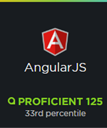
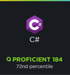

- 👋 Hi, I’m Martin Bonafede 
- 
- 🌱 I’m currently learning about AWS
- 📫 How to reach me, contact me at bonafedeit@gmail.com

<!--
*** Thanks for checking out the Best-README-Template. If you have a suggestion
*** that would make this better, please fork the repo and create a pull request
*** or simply open an issue with the tag "enhancement".
*** Don't forget to give the project a star!
*** Thanks again! Now go create something AMAZING! :D
-->

<!-- PROJECT SHIELDS -->
<!--
*** I'm using markdown "reference style" links for readability.
*** Reference links are enclosed in brackets [ ] instead of parentheses ( ).
*** See the bottom of this document for the declaration of the reference variables
*** for contributors-url, forks-url, etc. This is an optional, concise syntax you may use.
*** https://www.markdownguide.org/basic-syntax/#reference-style-links
-->
[![website][website-shield]][website-url]
[![MIT License][license-shield]][license-url]
[![LinkedIn][linkedin-shield]][linkedin-url]

<!-- PROJECT LOGO -->
 

  

  <h3 align="center">Martin Bonafede (@Bonafede)</h3>

  

    👀 I’m a backend developer, consultant, architect with a bit of devops. 
     
    <a href="https://github.com/bonafede/bonafede"><strong>Explore the docs »</strong></a>
     
     
    <a href="https://github.com/bonafede/bonafede">View Demo</a>
    ·
    <a href="https://github.com/bonafede/bonafede/issues">Report Bug</a>
    ·
    <a href="https://github.com/bonafede/bonafede/issues">Request Feature</a>
  

<!-- TABLE OF CONTENTS -->

  
Table of Contents

  <ol>
    <li>
      <a href="#work-experience">Work Experience</a>
      <ul>
        <li><a href="#current">Current</a></li>
        <li><a href="#digital-age">Digital Age</a></li>
        <li><a href="#checkout">Checkout</a></li>
        <li><a href="#healt-hero">Healt Hero</a></li>
        <li><a href="#zenfolio">Zenfolio</a></li>
        <li><a href="#kapsch-trafficom">Kapsch Trafficom</a></li>
        <li><a href="#cylarcom">Cylarcom</a></li>
        <li><a href="#apm-moller-maersk-group">APM Moller Maersk Group</a></li>
        <li><a href="#corporacion-tecnologica-rioplatense">Corporación Tecnológica Rioplatense</a></li>
        <li><a href="#baxter-argentina">Baxter Argentina</a></li>
      </ul>
    </li>
    <li>
      <a href="#freelance-experience">Freelance Experience</a>
      <ul>
        <li><a href="#bonait-srl">BonaIT</a></li>
        <li><a href="#kaph-srl">Kaph</a></li>
      </ul>
    </li>
    <li><a href="#usage">Skills & Programs</a></li>
    <li><a href="#roadmap">Language</a></li>
    <li>
        <a href="#contributing">Education</a>
        <ul>
            <li><a href="#built-with">Universidad Abierta Interamericana</a></li>
            <li><a href="#national-technological">National Technological University</a></li>
            <li><a href="#instituto-san-pedro-nolasco">Instituto San Pedro Nolasco</a></li>
        </ul>
    </li>
    <li>
        <a href="#more-information-and-certificates">MORE INFORMATION AND CERTIFICATES</a>
        <ul>
            <li><a href="#work-certificates">Work Certificates</a></li>
            <li><a href="#pluralsight-courses">Pluralsight Courses</a></li>
            <li><a href="#pluralsight-skills">Pluralsight Skills IQ Test</a></li>
            <li><a href="#linkedin-skills-certificate">Linkedin Skills Certificate</a></li>
        </ul>
    </li>
    <li><a href="#reference">Reference</a></li>
    <li><a href="#contact">Contact</a></li>
    <li><a href="#acknowledgments">Acknowledgments</a></li>
  </ol>

<!-- ABOUT THE PROJECT -->
## <h1>WORK EXPERIENCE</h1>

### <h2>Current</h2>

#### <h3>_Febraury 2022 : Present_</h3>

Prestart of an app for a pharmaceutic company. I start as the only developer selecting the technology and did a concept solution. The project just start and we are doing the structure of the solution and the UX design to agree with the client. I already set up a backend project that use GraphQL, Nest (in nodejs), TypeGraphQL (for typescript), Prisma and Postgresql.

 

### <h2>Digital Age</h2>

#### <h3>_November 2021 : Febraury 2022_</h3>

Architect and developers team leader. I enter as backend developer but after 2 weeks one of the agencies has problem with the client, so every developer left. I was left alone with 2 backend and 1 front end developers. Because the client does not have time, I had to take the structure decision, how the layers of the application will be distributed, the ERD, etc. I did the peer review of each commit of my teammates and develop new features. 
The project was a decentralized social network that work in a blockchain. It was made on net core with entity framework and blazor.

 

### <h2>Checkout</h2>

#### <h3>_Jun 2021 : November 2021_</h3>

Senior developer of an SDK project. We help on build a public SDK of checkout company on dot net. After finishing the dot net SDK, I help on develop de PHP SDK.

 

### <h2>Healt Hero</h2>

#### <h3>_Jun 2021 : November 2021_</h3>

Senior developer of a UK startup medical company. This company bought a lot of small company, and I was working on retro-engineering, refactor and adapt to company standards. 
-   Implement new features to the net core rest API microservices backend.
-   Maintenance of a net core rest API microservices backend.
-   Azure pipeline creation and maintenance
-   Postman E2E test to be run automatically on azure pipeline
-   Spike implement elastic search

 

### <h2>Zenfolio</h2>

#### <h3>_Jun 2020 : Jun 2021_</h3>

Senior developer of 3 solution between 10 solution that compose the microservices in Zenfolio products. One team in Argentina working with Russian and Vietnam team. Creation of new solution for commenting management, in charge of architectural selection in that project. Mantinean and evolution of .Net Core solutions backend with Entity Framework.

Reference PM: Andres Baldessari - [linkedin](https://www.linkedin.com/in/andresbaldessari/)
Reference coworker: Matias Katz - [linkedin](https://www.linkedin.com/in/matiasgabrielkatz/)

 

### <h2>Kapsch Trafficom</h2>

_<h3>Dec 2015 – Jun 2020 : Argentina, CABA / Remote </h3>_

<strong>_General Experience and role_</strong> 
Architect design and code review. Branch strategy and maintenance in git and TFS. Developer. Team building. Take Developers job interviews. Negotiate with the client. Order Jira Project.

<strong>_June 2020/ Present – Performance_</strong> 
We are improving the performance of the core project.

<strong>_April 2020/ June 2020 – Team Leader for Denmark and Ireland project_</strong> 
Same as Abu Dhabi, but an smaller team with only the Operational Back Office.

<strong>_April 2019/ April 2020 – Team Leader for Abu Dhabi project_</strong> 
The company implements a new platform in C#, angularjs webs, with IOC, NHibernet, and microservice approach. We sell it to United Arab Emirates so I was in charge of the developer team of this project. I was doing a lot of configuration manager work because of lack of resource. 

<strong>_April 2018/ April 2019 – Project Leader for Belarus project_</strong> 
During this period, we assign a team leader to Check and Poland project, he reports to the same project manager that I did, but the PM was focus on that two project and support the new team leader, so I was in charge of 1 Architect, 2 Tester, 4 developers and 1 system engineering. Most important we implement a big technical change on that takes an entire year to made, so we approach to more agile methodologic.

<strong>_April 2017/ April 2018 – Software team leader for Poland and Check republic project_</strong> 
I was promoting as team leader for two small projects. I was a developer, but I was doing the planning of each change request too, supervise the work of each develop and find ways to improve the productivity.
After a few months they give me another project (Belarus) to supervise too. During this time we had a lack of architect resource so I work as architect too.

<strong>_December 2015/ April 2017 – Semi senior Developer in Devops_</strong> 
I worked as a developer in a software factory. We had a big legacy desktop solution in Delphi and other in C#. We perform an evolutionarily maintenance within the solution. We had a cascade approach for each change request. Was analyzed the requirement, write the use cases, and after an architect design it we develop. After a while i start doing the architect work too because we lack of architects.

 

Reference PM: Jorge Zaiden - [linkedin](https://www.linkedin.com/in/andresbaldessari/)

Other reference: 
-	Juan Manuel Tripi – [linkedin](https://www.linkedin.com/in/miguel-angel-tripi-b66a3122/)
-	Eric Frick - [linkedin](https://www.linkedin.com/in/eric-frick-17078624/)

 

### <h2>Cylarcom</h2>

_<h3>April 2013 – December 2015 : Argentina, CABA</h3>_

This company sells a web management solution for mediums business in Argentina. For the beginning I start working with new web modules in Delphi .Net. After a time I was in charge of the migration of all the Backend development to C# .Net. We change the front end too to Angular JS and a new modern Front-End Design. I work a lot as developer using C#, SQL and NHibernet. 

 

### <h2>APM Moller Maersk Group</h2>

_<h3>April December 2007 – December 2015 : Argentina, CABA</h3>_

- <strong>_February 2010/ December 2015 - Damco Argentina S.A._</strong> 
    - Job: IT Manager
    - Desc:	I was in charge of the IT department. I was reporting to Latin American IT Manager. We create a new office and new datacenter. Buying new machines. Printer and workstation maintenance. Principal task during that time was the budget reduction. Seize office in Latin America. Active directory and group policies. 
- <strong>_December 2007/ January 2012  Maersk Argentina S.A_</strong> 
    - Job: Analyst
    - Desc:	Local and remote support. Datacenter Backup. In charge of VPN, workstation, ADSL, servers and networks maintainer. Analysis of the daily problems and investigation of software alternatives to improve the daily work of the customer services.
- <strong>_December 2007/ January 2010  Terminal 4 S.A._</strong> 
    - Job: Support intern (Feb 2008 – Jun 2008)
    - Desc:	Classic support to users. 
    - Job: Developer intern (Jul 2008 – Dec 2008)  
    - Desc: Develop and maintenance of the maritime software. vb6 app with SQL. 
    - Job: Project intern (Jan 2009 – Jun 2009)
    - Desc:	Participation in leadership of the project. Find problems and thinks about solutions. I implement an internal tool for the hardware tracking to improve the productivity of our IT department.
    - Job: Analyst (Jul 2009 – Feb 2010)
    - Desc:	General Support. In charge of managing purchased supplies

 

### <h2>Corporación Tecnológica Rioplatense</h2>

_<h3>November 2007 – December 2007: Argentina, CABA </h3>_

Installation of an specific software to enable in small towns the capability to charge in credit card. Help desk. 

 

### <h2>Baxter Argentina</h2>

_<h3>Mar 2005 – December 2006: Argentina, CABA </h3>_

Selling graduate trips. I delegate the « captains » of each neighborhood and which school has to go every person, I supervise the sales and give support where the delegated person was not doing well.

(<a href="#top">back to top</a>)

## <h1>FREELANCE EXPERIENCE</h1>

### <h2>BONAIT SRL</h2>

#### _<h3>May 2012 – April 2017 : Argentina, CABA</h3>_

I develop small web solutions for multiple clients. Normally a 3 moth work project for each client. The biggest client was a 6-month project. I join 5 people between designers and developers from different parts of Latin-American to work together as a team. Marketing. Google AdSense y AdWords. I was working as « Personal Geek » giving advice to people and companies about technology needs, I didn’t sell the technology only the knowledge.

 

### <h2>KAPH SRL</h2>

#### _<h3>January 2012 – May 2012 : Argentina, CABA</h3>_

Companies about 2 developers and 1 accountant, we give support to everything about IT and accountable systems (like tango) to small companies and pymes (Kavigo, Subaru, others). My main function was the development of sql scripts and reports,  commission settlement.

(<a href="#top">back to top</a>)

## <h1>SKILLS & PROGRAMS</h1>

### <h2>Develop</h2>

.Net, C#, Entity Framework, Postgres, Microsoft SQL Server, jQuery, PowerShell and Batch, JavaScript, Delphi, angular 1.6, Visual Basic, C++, 

### <h2>Web Design</h2>

HTML5, CSS3,  jQuery, JavaScript, Angular JS, Bootstrap.

### <h2>Versioning</h2>

Git, Gitlab, SVN and TFS. I was in charge multiple time of the branch strategy and maintenance of code. 

### <h2>Management</h2>

Jira, TFS, BMC Remedy, SCM, ERP, Azure

### <h2>UML</h2>

Microsoft Visio, Enterprise Architect.

### <h2>Hardware & Network</h2>
Basic knowledge of server performance requirement. Knowledge about DNS and infrastructure of datacenters with multiple nodes, load balancer and all the connection required form logical to physical structure.

### <h2>Operatives Systems</h2>

Windows Desktop and Windows server 2013-2018.

### <h2>BackOffice</h2>

MS Exchange

### <h2>General Softs</h2>

Word, Excel, Power Point, Visio, Access, Outlook 

### <h2>Basic Knowledge of</h2>

#### <h3>UML</h3>

ArgoUML, Poseidon for UML, OpenAmeos, StarUML, UML Designer.

#### <h3>ERP and Planning</h3>

Tango.

#### <h3>Web Design</h3>

VBScript, XML, Dreamweaver.

#### <h3>Design</h3>

3D Studio, Blender, 3D Mark Studio.

(<a href="#top">back to top</a>)

## <h1>LANGUAGE</h1>

Spanish: Native         
English: Fluent

(<a href="#top">back to top</a>)

## <h1>EDUCATION</h1>

### <h3>Universidad Abierta Interamericana - _January 2020 / Present_</h3>

### <h3>National Technological University - _February 2006 / December 2018_</h3>

### <h3>Instituto San Pedro Nolasco - _February 2000 / December 2005_</h3> 

(<a href="#top">back to top</a>)

## <h1>MORE INFORMATION AND CERTIFICATES</h1>

### <h2>Work Certificates</h2>

-   PEX Basics E-Learning Series	    
-   IT-Security Review Excellence

### <h2>Pluralsight Courses</h2>

-	AngularJS Front to Back with Web API
-	Working and Communicating with Different Personalities
-	Product Owner Fundamentals
-	Front End Web Development: Get Started
-	Front-End Web Development Quick Start with HTML5, CSS, and JavaScript	
-	NHibernate Fundamentals
-	RabbitMQ by Example
-	Inversion of Control
-	Angular JS: The Big Picture
-	AngularJS Material Fundamentals
-	HTML5 Fundamentals
-	AngularJS: Get Started
-	Scrum Master Fundamentals

### <h2>Pluralsight Skills IQ Test</h2>

### <h2>Linkedin Skills Certificate</h2>

- C# Verify Evaluation 
- JavaScript Verify Evaluation 

(<a href="#top">back to top</a>)

## <h1>REFERENCE</h1>

Jorge Zaiden - Kapsch Trafficom Argentina S.A 
- Job : Technical Delivery Manager
- Email : Jorge.Zaiden@gmail.com

(<a href="#top">back to top</a>)

## <h1>CONTACT</h1>

Martin Bonafede - +54 (911) 6858-6340 - contact@bonait.net

Github Repositories: [https://github.com/bona-soft/](https://github.com/bona-soft/)

(<a href="#top">back to top</a>)

 

## License

Distributed under the MIT License. See `LICENSE.txt` for more information.

(<a href="#top">back to top</a>)

## Acknowledgments

* [Choose an Open Source License](https://choosealicense.com)
* [GitHub Emoji Cheat Sheet](https://www.webpagefx.com/tools/emoji-cheat-sheet)
* [Malven's Flexbox Cheatsheet](https://flexbox.malven.co/)
* [Malven's Grid Cheatsheet](https://grid.malven.co/)
* [Img Shields](https://shields.io)
* [GitHub Pages](https://pages.github.com)
* [Font Awesome](https://fontawesome.com)
* [React Icons](https://react-icons.github.io/react-icons/search)

(<a href="#top">back to top</a>)

<!-- MARKDOWN LINKS & IMAGES -->
<!-- https://www.markdownguide.org/basic-syntax/#reference-style-links -->
[website-shield]: https://img.shields.io/github/issues/othneildrew/Best-README-Template.svg?style=for-the-badge
[website-url]: https://www.bonait.net
[license-shield]: https://img.shields.io/github/license/othneildrew/Best-README-Template.svg?style=for-the-badge
[license-url]: https://github.com/bonafede/bonafede/blob/master/LICENSE.txt
[linkedin-shield]: https://img.shields.io/badge/-LinkedIn-black.svg?style=for-the-badge&logo=linkedin&colorB=555
[linkedin-url]: https://linkedin.com/in/bonafede
[product-screenshot]: images/screenshot.png